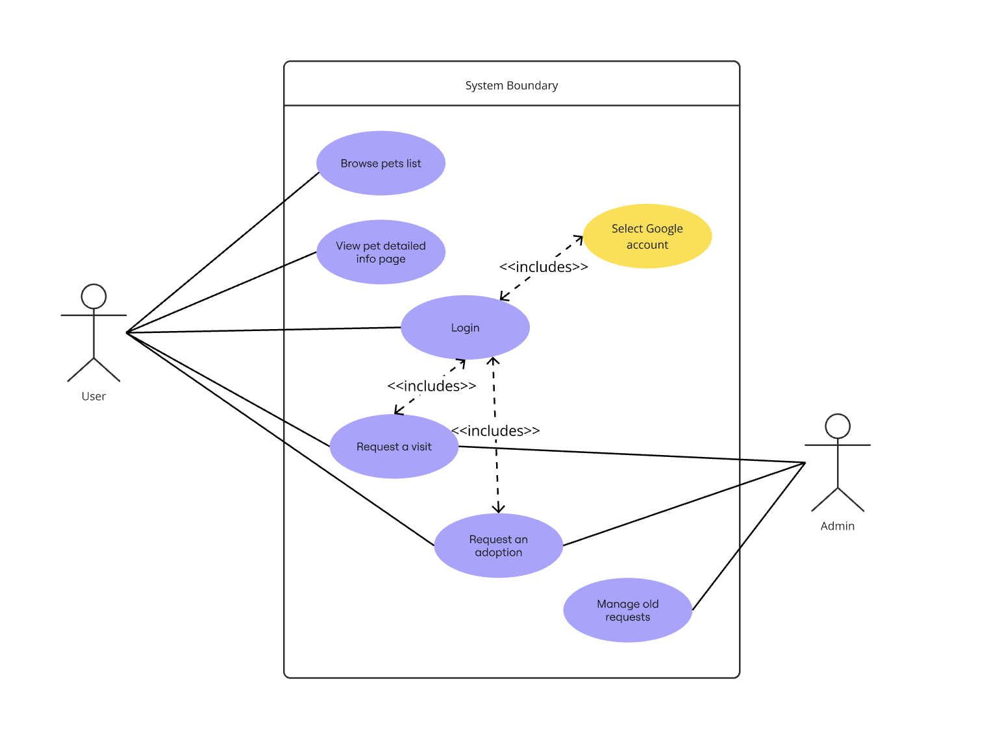
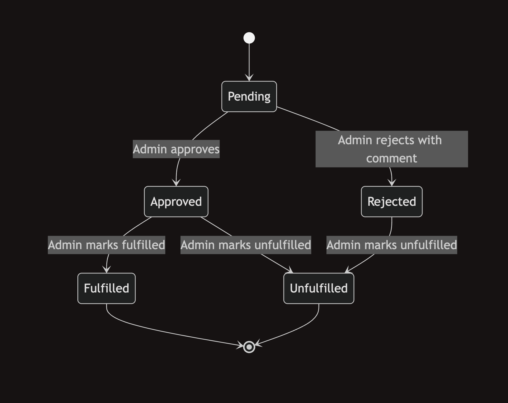

# Functional Requirements

## Use Cases

## Authentication
- A user should be able to authenticate in the app via Google authentication.

## Browse adoptable pets
- An auth-ed & non-auth-ed user should be able to browse list of pets.
- An auth-ed & non-auth-ed user should be able to view detailed information of a specific pet.

## Role System
The platform implements a 2-role hierarchical system:

- **user** - A person registered in order to send visit/adoption requests to the shelter
- **admin** - System administrators with full platform access, approving/rejecting user requests, managing pets in the system

## User page
- An authenticated user should be able to see requests he made.
  - Tabs view displays visit requests and adoption requests under the tabs.
  - Under a tab the first table should display information about requests: type (visit/adoption), pet name, date, status (pending/approved), comment.
  - Under a tab the second table should display information about archive requests: type (visit/adoption), pet name, date, status (rejected/fulfilled/unfulfilled), comment.
 
## Admin page
- Admin user should be able to see a list of requests.
  - Tabs view displays visit requests and adoption requests under the tabs.
  - Under a tab the first table should display information about requests: type (visit/adoption), pet name, date, status (pending/approved), comment, action.
  - Under a tab the second table should display information about archive requests: type (visit/adoption), pet name, date, status (rejected/fulfilled/unfulfilled), comment.
- Admin should be able to perform the next actions with requests:
  - Approve pending request.
  - Reject pending request, adding a comment.
  - Mark approved request fulfilled in case if visit happened/successful adoption.
  - Mark approved request unfulfilled in case if visit didn't happen/adoption didn't happen.
  - Move a request of status fulfilled/unfulfilled/rejected to archive list.
- Admin should be able to manage list of pets: create, update, delete. - _not in MVP_ 
- Admin should have a way to renew a pet in the system, due to the pet's returning to the shelter. - _not in MVP_ 

## Request visits
- An auth-ed user should be able to make a visit request to see a pet, entering date and time.
- Non-auth-ed user shouldn't be able to make a visit request to see a pet. Instead, a request for login should be shown.

## Request adoption
- An auth-ed user should be able to make an adoption request to adopt a pet.
  - Adoption should be allowed for users that visited (has fulfilled visit requests) the pet 5 times. ✅
  - A pet page shows a counter of visits for logged in user. ✅
- Non-auth-ed user shouldn't be able to make an adoption request to adopt a pet.

### Request state
Two types of requests: visit and adoption, share the same state flow.

### Pending
**Definition:** User created a request and is awaiting Admin review.

**Actions Available:**
- **Admin:** Approves a request
- **Admin:** Rejects a request with comment (comment is not implemented)

**Database State Example:**
{
`createdAt`: "2025-02-24T18:17:21.402Z";
`date`: "2025-02-24T22:00:00.000Z";
`id`: "8mpMnQ5nKGaFRHC9kCww";
`pawId`: "NcoRWf2EoEYYO4zMriww";
`pawName`: "Elinore";
`status`: "pending";
`time`: "18:30";
`type`: "visit";
`userEmail`: "user@gmail.com";
`userId`: "0ekorXgfqCVPz4G79En7Q3TUs5t2";
`userName`: "Name Lastname";
}

### Approved
**Definition:** Admin approved a request

**Actions Available:**
- **Admin:** Marks request fulfilled
- **Admin:** Marks request unfulfilled

**Database State Example:**
{
`createdAt`: "2025-02-24T18:17:21.402Z";
`date`: "2025-02-24T22:00:00.000Z";
`respondedAt`: "2025-02-24T18:01:55.013Z";
`id`: "8mpMnQ5nKGaFRHC9kCww";
`pawId`: "NcoRWf2EoEYYO4zMriww";
`pawName`: "Elinore";
`status`: "approved";
`time`: "18:30";
`type`: "visit";
`userEmail`: "user@gmail.com";
`userId`: "0ekorXgfqCVPz4G79En7Q3TUs5t2";
`userName`: "Name Lastname";
}

### Rejected
**Definition:** Admin rejected a request

**Actions Available:**
- **Admin:** Marks request unfulfilled

**Database State Example:**
{
`createdAt`: "2025-02-24T18:17:21.402Z";
`date`: "2025-02-24T22:00:00.000Z";
`respondedAt`: "2025-02-24T18:01:55.013Z";
`id`: "8mpMnQ5nKGaFRHC9kCww";
`pawId`: "NcoRWf2EoEYYO4zMriww";
`pawName`: "Elinore";
`status`: "rejected";
`time`: "18:30";
`type`: "visit";
`userEmail`: "user@gmail.com";
`userId`: "0ekorXgfqCVPz4G79En7Q3TUs5t2";
`userName`: "Name Lastname";
}

### Fulfilled
**Definition:** Admin marked a request as fulfilled, either user visited a shelter or adopted a pet.

**Actions Available:**
- End state

**Database State Example:**
{
`createdAt`: "2025-02-24T18:17:21.402Z";
`date`: "2025-02-24T22:00:00.000Z";
`respondedAt`: "2025-02-24T18:01:55.013Z";
`id`: "8mpMnQ5nKGaFRHC9kCww";
`pawId`: "NcoRWf2EoEYYO4zMriww";
`pawName`: "Elinore";
`status`: "fulfilled";
`time`: "18:30";
`type`: "visit";
`userEmail`: "user@gmail.com";
`userId`: "0ekorXgfqCVPz4G79En7Q3TUs5t2";
`userName`: "Name Lastname";
}

### Unfulfilled
**Definition:** Admin marked a request as unfulfilled, either user didn't visit a shelter or didn't adopt a pet. Also a rejected request could be marked as unfulfilled in order to be moved to archive on frontend.

**Actions Available:**
- End state

**Database State Example:**
{
`createdAt`: "2025-02-24T18:17:21.402Z";
`date`: "2025-02-24T22:00:00.000Z";
`respondedAt`: "2025-02-24T18:01:55.013Z";
`id`: "8mpMnQ5nKGaFRHC9kCww";
`pawId`: "NcoRWf2EoEYYO4zMriww";
`pawName`: "Elinore";
`status`: "unfulfilled";
`time`: "18:30";
`type`: "visit";
`userEmail`: "user@gmail.com";
`userId`: "0ekorXgfqCVPz4G79En7Q3TUs5t2";
`userName`: "Name Lastname";
}
